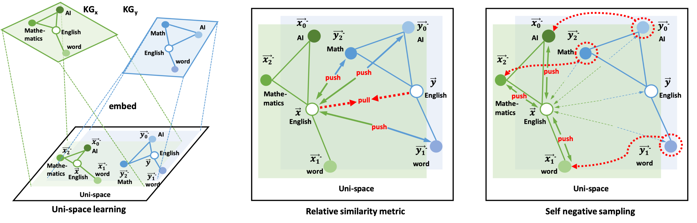

# SelfKG

Self-supervised Entity Alignment without using labels. For more details, please refer to:

[A Self-supervised Method for Entity Alignment](https://arxiv.org/pdf/2106.09395.pdf)

[Xiao Liu\*](https://xiao9905.github.io), Haoyun Hong\*, Xinghao Wang, Zeyi Chen, Evgeny Kharlamov, [Yuxiao Dong](https://ericdongyx.github.io/), [Jie Tang](http://keg.cs.tsinghua.edu.cn/jietang/)



## 1. Setup

**Dependencies**

```bash
torch # just choose the version based on your machine 
faiss-cpu
numpy
pandas
tqdm
transformers
```
You can use `setup.sh` to set up your Anaconda environment.

**Data**

You can download the our data from [here](https://cloud.tsinghua.edu.cn/d/c1df705453784e568a23/), and the final structure our project should be:

```bash
├── data
│   ├── DBP15K
│   │   ├── fr_en
│   │   ├── ja_en
│   │   └── zh_en
│   ├── DWY100K
│   │   ├── dbp_wd
│   │   └── dbp_yg
│   └── LaBSE
│       ├── bert_config.json
│       ├── bert_model.ckpt.index
│       ├── checkpoint
│       ├── config.json
│       ├── pytorch_model.bin
│       └── vocab.txt
├── loader
├── model
├── run_DWY_LaBSE_neighbor.py
├── run_LaBSE_neighbor.py
├── run_LaBSE_SSL_DWY.py
├── run_LaBSE_SSL.py
├── script
│   └── preprocess
└── settings.py
```

## 2. Run experiments

You can use 

```bash experiments.sh```

 to reproduce our experiments results. For more details, please refer to `experiments.sh` and our code.

## Citation

If you find this work useful, please cite the following paper:

```
@article{liu2021self,
  title={A Self-supervised Method for Entity Alignment},
  author={Liu, Xiao and Hong, Haoyun and Wang, Xinghao and Chen, Zeyi and Kharlamov, Evgeny and Dong, Yuxiao and Tang, Jie},
  journal={arXiv preprint arXiv:2106.09395},
  year={2021}
}
```
