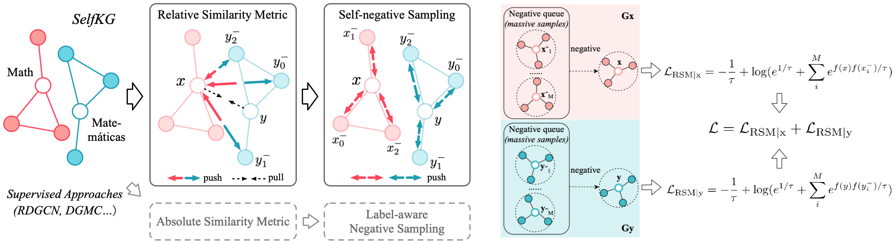

<p align="center"><a href="https://github.com/THUDM/SelfKG/blob/main/LICENSE"></a>

# SelfKG: Self-Supervised Entity Alignment in Knowledge Graphs

Original implementation for paper SelfKG: Self-Supervised Entity Alignment in Knowledge Graphs.   

This paper is accepted by  [The Web Conference2022](https://www2022.thewebconf.org/)! :satisfied:

SelfKG is the **first** **self-supervised** entity alignment method **without label supervision**, which can **match or achieve comparable results with state-of-the-art supervised baselines**. The performance of SelfKG suggests self-supervised learning offers great potential for entity alignment in Knowledge Graphs.

[SelfKG: Self-Supervised Entity Alignment in Knowledge Graphs](https://arxiv.org/abs/2203.01044)

- [Installation](#installation)
  - [Requirements](#requirements)
- [Quick Start](#quick-start)
  - [Data Preparation](#data-preparation)
  - :star:[Run Experiments](#run-experiments)
- [❗ Common Issues](#-common-issues)
- [Citing SelfKG](#citing-selfkg)

## Installation

### Requirements

```txt
torch==1.9.0
faiss-cpu==1.7.1
numpy>=1.21
pandas==1.2.5
tqdm==4.61.1
transformers==4.8.2
```

You can use [`setup.sh`](https://github.com/THUDM/SelfKG/blob/main/setup.sh) to set up your Anaconda environment.

## Quick Start

### Data Preparation

You can download the our data from [here](https://zenodo.org/record/6326870#.YiI2K6tBxPY), and the final structure our project should be:

```bash
├── data
│   ├── DBP15K
│   │   ├── fr_en
│   │   ├── ja_en
│   │   └── zh_en
│   ├── DWY100K
│   │   ├── dbp_wd
│   │   └── dbp_yg
│   └── LaBSE
│       ├── bert_config.json
│       ├── bert_model.ckpt.index
│       ├── checkpoint
│       ├── config.json
│       ├── pytorch_model.bin
│       └── vocab.txt
│   └── getdata.sh
├── loader
├── model
├── run.sh # Please use this bash to run the experiments!
├── run_DWY_LaBSE_neighbor.py # SelfKG on DWY100k
├── run_LaBSE_neighbor.py # SelfKG on DBP15k
... # run_LaBSE_*.py # Ablation code will be available soon
├── script
│   └── preprocess
├── settings.py
└── setup.sh # Can be used to set up your Anaconda environment
```

You can also use the following scripts to download the datasets directly:

```bash
cd data
bash getdata.sh
```

### :star:Run Experiments

**Please use**

**`bash run.sh`**

 to reproduce our experiments results. For more details, please refer to [`run.sh`](https://github.com/THUDM/SelfKG/blob/main/run.sh) and our code.

## ❗ Common Issues

<details>
<summary>
"XXX file not found"
</summary>
<br/>
Please make sure you've downloaded all the dataset according to README.
</details>


to be continued ...


## Citing SelfKG

If you use SelfKG in your research or wish to refer to the baseline results, please use the following BibTeX.

```
in preparation ...
```
